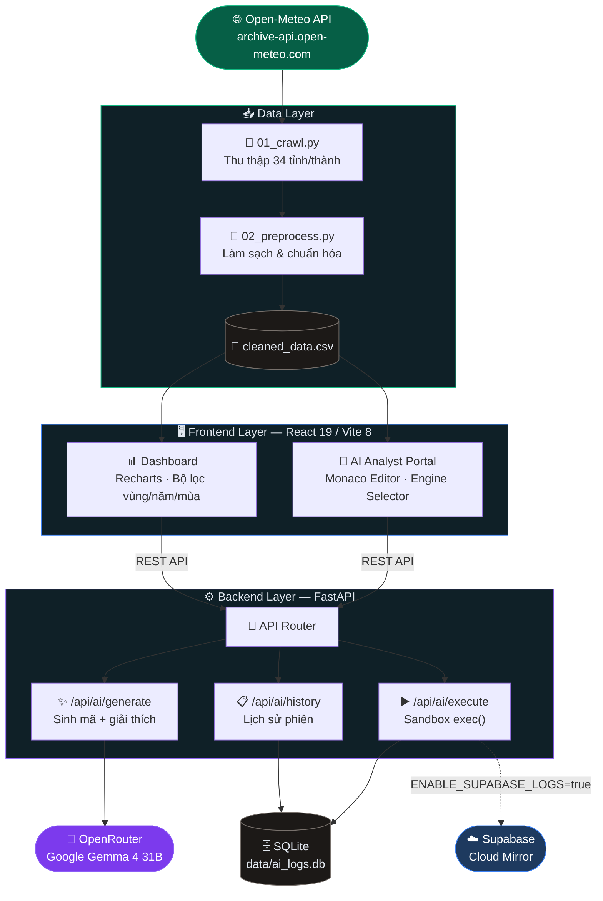
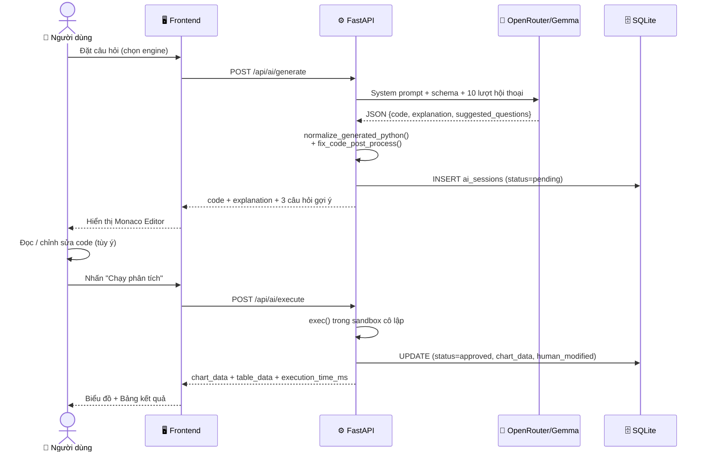

<div align="center">


<br/>

[](https://python.org)
[](https://react.dev)
[](https://fastapi.tiangolo.com)
[](https://vitejs.dev)
[](https://supabase.com)
[](https://openrouter.ai)
[](LICENSE)

<br/>

> **Nền tảng phân tích và trực quan hóa dữ liệu khí tượng thủy văn Việt Nam tích hợp trợ lý AI.**  
> Dữ liệu 34 tỉnh/thành từ Open-Meteo API · Dashboard tương tác · Trợ lý AI với Human-in-the-Loop

</div>

---

## 📋 Mục lục

| | |
|---|---|
| [✨ Tính năng](#-tính-năng) | [🏗️ Kiến trúc](#️-kiến-trúc-hệ-thống) |
| [📁 Cấu trúc dự án](#-cấu-trúc-dự-án) | [⚡ Cài đặt nhanh](#-cài-đặt-nhanh) |
| [🔑 Cấu hình môi trường](#-cấu-hình-biến-môi-trường) | [🚀 Khởi động](#-khởi-động) |
| [🤖 Trợ lý AI](#-trợ-lý-ai--human-in-the-loop) | [🛠️ Công nghệ](#️-công-nghệ-sử-dụng) |

---

## ✨ Tính năng

<table>
<tr>
<td width="50%">

### 📊 Dashboard Trực quan
- Biểu đồ tương tác: **line, bar, area, scatter, radar, pie, donut, wind-rose, histogram**
- Bộ lọc liên động: **vùng địa lý · năm · tháng · mùa**
- Dữ liệu **34 tỉnh/thành** · 7 vùng khí hậu
- So sánh đa tỉnh, đa mùa, đa năm
- Chế độ **dark / light** tự động

</td>
<td width="50%">

### 🤖 Trợ lý AI (Human-in-the-Loop)
- Sinh mã phân tích bằng **ngôn ngữ tự nhiên**
- 3 engine: **Python (Pandas) · SQL (DuckDB) · R (dplyr style)**
- **Phê duyệt trước khi chạy** — không thực thi ngầm
- Hội thoại **đa lượt** có ngữ cảnh (conversation chains)
- Gợi ý **3 câu hỏi tiếp theo** sau mỗi kết quả

</td>
</tr>
<tr>
<td width="50%">

### 🔒 Bảo mật & Sandbox
- Thực thi trong **namespace cô lập** với builtins bị giới hạn
- **Không** truy cập mạng, file hệ thống, subprocess
- Khóa API chỉ nằm ở biến môi trường backend
- Ghi nhận flag `human_modified` nếu người dùng chỉnh sửa mã

</td>
<td width="50%">

### 💾 Lịch sử & Xuất dữ liệu
- Log đầy đủ vào **SQLite** cục bộ (`data/ai_logs.db`)
- Tùy chọn đồng bộ lên **Supabase** Cloud
- Xuất kết quả bảng ra **CSV** (BOM UTF-8, mở được Excel)
- **Lưu biểu đồ dạng PNG** trực tiếp từ giao diện (độ phân giải 2×, nền trắng)
- Xem lại mã AI gốc vs. mã người dùng đã duyệt

</td>
</tr>
</table>

---

## 🏗️ Kiến trúc hệ thống



### Luồng AI (Human-in-the-Loop)



---


## 📁 Cấu trúc dự án

```
hydrometeorology_vn_analytics/
│
├── 📂 src/                          # Scripts thu thập & tiền xử lý dữ liệu
│   ├── 01_crawl.py                  # Thu thập từ Open-Meteo API (34 tỉnh)
│   └── 02_preprocess.py             # Làm sạch & chuẩn hóa → CSV
│
├── 📂 data/
│   ├── raw/                         # CSV thô từ Open-Meteo
│   ├── processed/cleaned_data.csv   # Dữ liệu đã làm sạch (nguồn gốc)
│   └── ai_logs.db                   # SQLite: lịch sử phiên AI
│
├── 📂 backend/                      # FastAPI backend chính
│   └── main.py                      # Entry point — tất cả API endpoints
│
├── 📂 frontend/                     # React / Vite frontend
│   ├── src/
│   │   ├── App.jsx                  # Router & layout chính
│   │   ├── components/
│   │   │   ├── AIAnalystPortal.jsx  # Trợ lý AI (giao diện chính)
│   │   │   ├── AnalysisView.jsx     # Dashboard biểu đồ
│   │   │   ├── SettingsView.jsx     # Cài đặt API key
│   │   │   ├── AnimatedBackground.jsx
│   │   │   └── ...
│   │   └── hooks/
│   │       └── useCsvData.js        # Hook tải & lọc CSV
│   ├── public/data/kttv.csv         # CSV được serve tĩnh cho frontend
│   └── package.json
│
├── .env                             # Biến môi trường (KHÔNG commit)
├── .env.example                     # Template cấu hình
├── .gitignore
├── requirements.txt                 # Python dependencies
├── README.md
└── LICENSE
```

---

## ⚡ Cài đặt nhanh

### Yêu cầu hệ thống

| Công cụ | Phiên bản tối thiểu |
|---------|---------------------|
| Python | 3.10+ |
| Node.js | 18+ |
| npm | 9+ |

### 1. Clone & chuẩn bị

```bash
git clone https://github.com/HenryBui777/hydrometeorology_vn_analytics.git
cd hydrometeorology_vn_analytics

# Tạo file .env từ template
cp .env.example .env
# → Mở .env và điền OPENROUTER_API_KEY, SUPABASE_URL, SUPABASE_KEY
```

### 2. Cài đặt backend

```bash
# Cài thư viện Python
pip install -r requirements.txt

# Hoặc dùng venv (khuyến nghị)
python -m venv venv
venv\Scripts\activate          # Windows
source venv/bin/activate       # macOS / Linux
pip install -r requirements.txt
```

### 3. Cài đặt frontend

```bash
cd frontend
npm install
```

### 4. Chuẩn bị dữ liệu (nếu chưa có)

```bash
# Thu thập dữ liệu từ Open-Meteo (cần kết nối mạng, ~5-10 phút)
python src/01_crawl.py

# Làm sạch & xuất CSV
python src/02_preprocess.py

# Copy CSV vào thư mục public của frontend
cp data/processed/cleaned_data.csv frontend/public/data/kttv.csv
```

> **Lưu ý:** `frontend/public/data/kttv.csv` đã có sẵn trong repo — bỏ qua bước này nếu chỉ muốn chạy demo.

---

## 🔑 Cấu hình biến môi trường

Mở file `.env` và điền các giá trị:

| Biến | Bắt buộc | Mô tả | Lấy ở đâu |
|------|----------|-------|-----------|
| `OPENROUTER_API_KEY` | ✅ | API key cho trợ lý AI | [openrouter.ai/keys](https://openrouter.ai/keys) |
| `SUPABASE_URL` | ✅ | URL project Supabase | Supabase → Project Settings → API |
| `SUPABASE_KEY` | ✅ | Service role key | Supabase → Project Settings → API |
| `VITE_SUPABASE_URL` | ✅ | URL Supabase (frontend) | Giống `SUPABASE_URL` |
| `VITE_SUPABASE_ANON_KEY` | ✅ | Anon/public key (frontend) | Supabase → anon key |
| `OPENROUTER_MODEL` | ⚙️ | Mô hình AI | Mặc định: `google/gemma-4-31b-it:free` |
| `VITE_API_BASE_URL` | ⚙️ | URL backend | Mặc định: `http://localhost:8000` |
| `ENABLE_SUPABASE_LOGS` | ❌ | Đồng bộ logs lên cloud | Mặc định: `false` |

---

## 🚀 Khởi động

### Backend (FastAPI)

```bash
# Từ thư mục gốc
cd backend
uvicorn main:app --host 0.0.0.0 --port 8000 --reload
```

Hoặc (Windows, tránh lỗi encoding):

```powershell
$env:PYTHONUTF8='1'
py -m uvicorn main:app --host 0.0.0.0 --port 8000 --reload
```

→ API docs: **http://localhost:8000/docs**

### Frontend (React/Vite)

```bash
cd frontend
npm run dev
```

→ Giao diện: **http://localhost:5173**

### Chạy cả hai cùng lúc (PowerShell)

```powershell
Start-Process powershell -ArgumentList "-NoExit", "-Command", "cd backend; `$env:PYTHONUTF8='1'; py -m uvicorn main:app --reload"
Start-Process powershell -ArgumentList "-NoExit", "-Command", "cd frontend; npm run dev"
```

---

## 🤖 Trợ lý AI — Human-in-the-Loop

Hệ thống AI tuân thủ nguyên tắc **không thực thi ngầm**:

```
1. Người dùng đặt câu hỏi bằng tiếng Việt tự nhiên
        ↓
2. AI (OpenRouter / Gemma 4 31B) sinh mã + giải thích 5 mục:
   • Phương pháp phân tích
   • Các bước xử lý
   • Chỉ số & metric
   • Cách đọc kết quả
   • Ghi chú hạn chế dữ liệu
        ↓
3. Mã hiển thị trong Monaco Editor → Người dùng đọc, chỉnh sửa (tùy ý)
        ↓
4. Nhấn "Chạy phân tích" → Backend exec() trong sandbox cô lập
        ↓
5. Kết quả: biểu đồ + bảng dữ liệu + 3 câu hỏi gợi ý tiếp theo
        ↓
6. Toàn bộ ghi vào SQLite (original_code vs human_edited_code)
```

### Chọn engine phân tích

| Engine | Mô tả |
|--------|-------|
| 🐍 **Python** | Pandas thuần, không cần import (`pd`, `df`, `np` đã inject sẵn) |
| 🗃️ **SQL** | DuckDB query trực tiếp trên DataFrame trong RAM |
| 📊 **R** | Python với comment R-equivalent (cho người dùng nền R) |

---

## 🛠️ Công nghệ sử dụng

<table>
<tr><th>Lớp</th><th>Công nghệ</th><th>Phiên bản</th><th>Mục đích</th></tr>
<tr>
  <td rowspan="4"><b>Frontend</b></td>
  <td>React</td><td>19</td><td>UI framework</td>
</tr>
<tr><td>Vite</td><td>8</td><td>Build tool & dev server</td></tr>
<tr><td>Recharts</td><td>^3.9</td><td>Biểu đồ tương tác</td></tr>
<tr><td>Monaco Editor</td><td>^4.7</td><td>Code editor với syntax highlight</td></tr>
<tr>
  <td rowspan="4"><b>Backend</b></td>
  <td>FastAPI</td><td>0.115+</td><td>REST API framework</td>
</tr>
<tr><td>Pandas</td><td>2.x</td><td>Xử lý dữ liệu CSV</td></tr>
<tr><td>DuckDB</td><td>1.x</td><td>SQL trực tiếp trên DataFrame</td></tr>
<tr><td>SQLite</td><td>built-in</td><td>Lưu lịch sử AI cục bộ</td></tr>
<tr>
  <td rowspan="3"><b>AI & Cloud</b></td>
  <td>OpenRouter</td><td>-</td><td>AI gateway (Gemma 4 31B)</td>
</tr>
<tr><td>Supabase</td><td>-</td><td>Auth + cloud log mirror</td></tr>
<tr><td>Open-Meteo API</td><td>-</td><td>Nguồn dữ liệu khí tượng miễn phí</td></tr>
</table>

---

## 📊 Dữ liệu

- **Nguồn:** [Open-Meteo Historical API](https://archive-api.open-meteo.com)
- **Phạm vi:** 34 tỉnh/thành · 7 vùng địa lý · 2025–2026
- **Các chỉ số:** nhiệt độ (min/max/mean) · lượng mưa · độ ẩm · giờ nắng · tốc độ gió · bốc hơi (ET₀) · mây che phủ

---

## 📄 License

[MIT License](LICENSE) © 2026 
