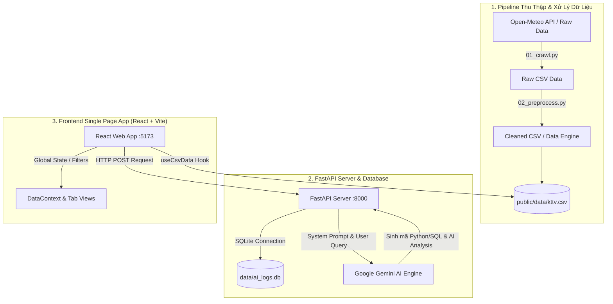

# 🌏 Hydrometeorology VN Analytics — Nền tảng Phân Tích & Trực Quan Hóa Dữ Liệu Khí Tượng Thủy Văn Việt Nam Tích Hợp Trợ Lý AI

Nền tảng phân tích và trực quan hóa dữ liệu Khí tượng Thủy văn (KTTV) 34 tỉnh thành Việt Nam (dữ liệu cập nhật từ **Tháng 7/2025 đến Tháng 7/2026**). Hệ thống xây dựng trên kiến trúc **React + Vite + Tailwind CSS** kết hợp backend **FastAPI**, cơ sở dữ liệu **SQLite**, và mô hình **Trợ lý AI lập trình phân tích dữ liệu (Gemini AI)** chế độ Human-in-the-Loop.

---

## 📁 Cấu Trúc Thư Mục Đồ Án

```text
hydrometeorology_vn_analytics/
├── .env                         # Cấu hình biến môi trường (AI Key, Database, Port)
├── .env.example                 # File mẫu cấu hình môi trường
├── requirements.txt             # Thư viện Python phục vụ Backend & Data Pipeline
├── package.json                 # Cấu hình dự án Frontend
├── README.md                    # Tài liệu hướng dẫn đồ án
├── data/                        # Thư mục dữ liệu
│   ├── ai_logs.db               # SQLite lưu vết lịch sử câu hỏi & mã Python/SQL do AI sinh
│   ├── processed/
│   │   └── cleaned_data.csv     # Dữ liệu sạch đã xử lý
│   └── raw/
│       └── vietnam_kttv_34tinh_*.csv  # Dữ liệu thô 34 tỉnh thành
├── src/                         # Mã nguồn Python Backend & Pipeline
│   ├── 01_crawl.py              # Script thu thập dữ liệu KTTV từ Open-Meteo API
│   ├── 02_preprocess.py         # Script chuẩn hóa & làm sạch dữ liệu CSV
│   └── backend/
│       ├── main.py              # FastAPI Web Application entrypoint
│       ├── database.py          # Kết nối & quản lý SQLite DB
│       └── routers/
│           └── ai_router.py     # API Router xử lý tích hợp Gemini AI Analyst
└── frontend/                    # Ứng dụng Web Single Page (React + Vite)
    ├── public/
    │   ├── data/kttv.csv        # Tập dữ liệu CSV chuẩn dùng cho Frontend
    │   └── vietnam_merged_provinces.geojson # Bản đồ hình học 34 tỉnh thành
    ├── src/
    │   ├── main.jsx             # Entry point React
    │   ├── App.jsx              # Routing các tab & State ứng dụng
    │   ├── index.css            # Styling hệ thống & Tailwind utilities
    │   ├── context/
    │   │   └── DataContext.jsx  # Global Context quản lý bộ lọc & chế độ mù màu
    │   ├── hooks/
    │   │   └── useCsvData.js    # Custom Hook nạp & lọc dữ liệu CSV
    │   └── components/
    │       ├── Header.jsx           # Thanh Header chính & điều hướng tab
    │       ├── Sidebar.jsx          # Thanh Menu điều hướng
    │       ├── HomeDashboard.jsx    # Tab 1: Dashboard Tổng quan
    │       ├── TimeSeriesView.jsx   # Tab 2: Chuỗi Thời Gian
    │       ├── ComparisonView.jsx   # Tab 3: So Sánh Vùng Miền
    │       ├── AnalysisView.jsx     # Tab 4: Phân Tích & Dự Báo
    │       ├── AIAnalystPortal.jsx  # Tab 5: Trợ Lý Lập Trình AI
    │       └── DatasetManagement.jsx # Tab 6: Quản Lý Tập Dữ Liệu
    └── vite.config.js
```

---

## 🏗️ Kiến Trúc Pipeline Dữ Liệu & AI Engine

Sơ đồ thể hiện luồng xử lý từ thu thập dữ liệu, lưu trữ cơ sở dữ liệu, đến máy chủ FastAPI, mô hình AI Gemini và giao diện React Web:



---

## 🎯 Chi Tiết Chức Năng 6 Tab Trên Giao Diện

### 1. 📊 Dashboard Tổng Quan (`HomeDashboard.jsx`)
- **Bộ lọc 3 chiều toàn diện:** Lọc linh hoạt theo **Khu vực** (7 vùng địa lý), **Thời gian** (Đầy đủ 12 tháng: Tháng 7/2025 - Tháng 7/2026), và **4 Mùa** (Xuân, Hè, Thu, Đông).
- **4 Thẻ KPI Cảnh Báo Thông Minh:** Cập nhật thời gian thực chỉ số Nhiệt độ, Lượng mưa, Chỉ số UV (với biểu tượng Kính râm 👓), và Khô hạn.
- **Bản đồ Khí hậu Tương tác:** Bản đồ GeoJSON 34 tỉnh thành Việt Nam với zoom/pan linh hoạt, hover tooltip chi tiết chỉ số từng tỉnh, phân màu rành mạch giữa *Trạm đo trực tiếp* và *Dữ liệu sáp nhập/nội suy*.
- **Khung Thông Tin Vùng/Cả Nước:** Tự động đồng bộ số liệu và nhảy tên vùng hoặc hiển thị chỉ số **Toàn Quốc (Cả nước)** khi chọn lọc.
- **Bảng Xếp Hạng Khí Hậu Tùy Biến:** Cụm bộ lọc riêng cho phép chuyển đổi **Top Cao Nhất ↔ Top Thấp Nhất**, **Top 5 ↔ Top 10**, và hỗ trợ trọn bộ 4 chỉ số (Nhiệt độ, Lượng mưa, Độ ẩm, Tốc độ gió). Các thứ hạng 1, 2, 3 được bo vòng tròn **Huy chương Vàng 🥇, Bạc 🥈, Đồng 🥉** nổi bật.

### 2. 📈 Chuỗi Thời Gian (`TimeSeriesView.jsx`)
- **Biểu đồ Đa đường (Multi-line Chart):** Trực quan hóa diễn biến chỉ số theo thời gian của nhiều tỉnh thành trên cùng một trục tọa độ.
- **Tùy chọn chỉ số đa dạng:** Phân tích biến thiên Nhiệt độ trung bình, Nhiệt độ cao nhất/thấp nhất, Lượng mưa, Độ ẩm, và Tốc độ gió.
- **Xác định đỉnh điểm & điểm bất thường:** Tự động phát hiện các mốc ngày có thời tiết cực đoan.

### 3. ⚔️ So Sánh Vùng Miền (`ComparisonView.jsx`)
- **Đối chiếu khí hậu 7 vùng địa lý:** So sánh trực quan chỉ số giữa các vùng (Bắc Bộ, Trung Bộ, Nam Bộ, Tây Nguyên,...).
- **Biểu đồ Ra-đa & Biểu đồ Cột ngang:** Đánh giá điểm tương đồng và khác biệt về đặc trưng khí hậu giữa các vùng miền.

### 4. 🔬 Phân Tích & Dự Báo (`AnalysisView.jsx`)
- **Mô hình tương quan đa biến:** Phân tích mối liên hệ giữa các yếu tố KTTV (Nhiệt độ vs Lượng mưa, Bức xạ mặt trời vs Nhiệt độ).
- **Phân bố khí hậu theo mùa:** Trực quan hóa sự chuyển giao thời tiết qua 4 mùa trong năm.

### 5. 🤖 Trợ Lý Lập Trình AI (`AIAnalystPortal.jsx`)
- **Tích hợp Gemini AI Engine:** Cho phép người dùng nhập câu hỏi bằng tiếng Việt tự nhiên.
- **Tự động sinh mã phân tích:** AI tự động viết đoạn mã Python Pandas hoặc truy vấn SQL để xử lý tập dữ liệu.
- **Chế độ Human-in-the-Loop:** Giao diện xem xét mã nguồn (Code Review), sửa mã và phê duyệt trước khi thực thi.

### 6. 📁 Quản Lý Tập Dữ Liệu (`DatasetManagement.jsx`)
- **Quản lý dữ liệu KTTV 34 tỉnh thành:** Hiển thị và xem trước 12.410 bản ghi dữ liệu.
- **Nạp tập dữ liệu mới:** Cho phép nạp tập dữ liệu CSV tùy chỉnh hoặc khôi phục tập dữ liệu mặc định.
- **Cấu trúc trường dữ liệu:** Cung cấp thông tin chi tiết các cột chỉ số khí tượng.

---

## 💻 Cấu Hình File Biến Môi Trường (`.env`)

Tạo file `.env` tại thư mục gốc của dự án với đầy đủ thông tin kết nối Supabase Cloud DB, Gemini AI Key và Backend FastAPI:

```ini
# Cấu hình Supabase Cloud Database & OAuth Authentication
SUPABASE_URL=https://your-supabase-project-id.supabase.co
SUPABASE_KEY=your-supabase-service-role-or-anon-key
VITE_SUPABASE_URL=https://your-supabase-project-id.supabase.co
VITE_SUPABASE_ANON_KEY=your-supabase-anon-key

# Cấu hình API Key Gemini AI
GEMINI_API_KEY=AQ.Ab8RN6IeBa1n7oyTK4Lh7bngSYrFMYydDOHmiOVc4_fJL_1Wkw
AI_ENGINE_MODEL=gemini-3.5-flash

# Cấu hình Cơ sở dữ liệu SQLite Nội Bộ
DATABASE_URL=sqlite:///./data/ai_logs.db
DB_PATH=./data/ai_logs.db

# Cấu hình Server FastAPI Backend
HOST=0.0.0.0
PORT=8000
BACKEND_URL=http://localhost:8000

# Cấu hình Frontend React Vite
VITE_API_BASE_URL=http://localhost:8000
```

---

## 🛠️ Danh Sách Thư Viện Python (`requirements.txt`)

File `requirements.txt` bao gồm các thư viện cần thiết:

```text
fastapi>=0.100.0
uvicorn>=0.22.0
pandas>=2.0.0
numpy>=1.24.0
scikit-learn>=1.3.0
google-generativeai>=0.3.0
python-dotenv>=1.0.0
pydantic>=2.0.0
requests>=2.31.0
duckdb>=0.9.0
```

---

## 🚀 Hướng Dẫn Chạy Đồ Án (Windows PowerShell)

> Mở **2 cửa sổ PowerShell**: một cửa sổ chạy Backend và một cửa sổ chạy Frontend.
> Không chạy lệnh `uvicorn src.backend.main:app ...` trong thư mục `src/backend`, vì phiên bản đồ án đang sử dụng entrypoint `backend/main.py`.

### 0. Điều kiện cần

- Python 3.10 trở lên và Node.js 18 trở lên.
- Có sẵn dữ liệu tại `data/processed/cleaned_data.csv`.
- Tạo file `.env` ở thư mục gốc dự án. Để chạy Dashboard cơ bản, có thể dùng cấu hình Supabase/Gemini của nhóm. Nếu muốn dùng chức năng Gemini, điền khóa của riêng bạn và **không đưa khóa lên GitHub**.

Ví dụ `.env` tối thiểu:

```ini
SUPABASE_URL=https://your-project.supabase.co
SUPABASE_KEY=your_supabase_key
GEMINI_API_KEY=your_gemini_api_key
```

### Cách chạy nhanh mỗi lần làm bài

**Terminal 1 – Backend:**

```powershell
cd D:\download\hydrometeorology_vn_analytics
python -m pip install -r requirements.txt
cd backend
python main.py
```

Khi terminal hiện `Uvicorn running on http://127.0.0.1:8000`, backend đã hoạt động. Có thể kiểm tra tại `http://127.0.0.1:8000/docs`.

**Terminal 2 – Frontend:**

```powershell
cd D:\download\hydrometeorology_vn_analytics\frontend
npm install
npm run dev
```

Mở địa chỉ Vite in ra trong terminal (thường là `http://localhost:5173`).

Sau lần đầu, chỉ cần chạy `python main.py` ở terminal Backend và `npm run dev` ở terminal Frontend. Nhấn `Ctrl + C` để dừng từng server.

### Khắc phục nhanh

- **Trang trắng hoặc chưa nhận thay đổi:** nhấn `Ctrl + F5` trên trình duyệt.
- **AI báo `Failed to fetch`:** kiểm tra Backend đang chạy ở cổng `8000` và Frontend ở `5173`.
- **Cổng 5173 đang bận:** dừng terminal Vite cũ bằng `Ctrl + C`, rồi chạy lại `npm run dev`.
- **AI trả về kết quả cũ:** tạo một câu hỏi mới sau khi khởi động lại Backend.

---

## Hướng Dẫn Khởi Chạy Source Code (tham khảo chi tiết)

### Bước 1: Khởi chạy Backend FastAPI (Port 8000)

1. Mở cửa sổ Terminal tại thư mục gốc của dự án (`d:\hydrometeorology_vn_analytics`).
2. Cài đặt các thư viện Python:
   ```powershell
   pip install -r requirements.txt
   ```
3. Khởi chạy máy chủ FastAPI Backend:
   ```powershell
   cd backend
   python main.py
   ```
   *(Backend sẽ chạy tại: `http://localhost:8000` - Tài liệu Swagger API tại: `http://localhost:8000/docs`)*

---

### Bước 2: Khởi chạy Frontend React Vite (Port 5173)

1. Mở một cửa sổ Terminal mới và di chuyển vào thư mục `frontend`:
   ```powershell
   cd frontend
   ```
2. Cài đặt Node modules (chỉ cần chạy lần đầu):
   ```powershell
   npm install
   ```
3. Khởi chạy Development Server:
   ```powershell
   npm run dev
   ```
4. Truy cập ứng dụng trên trình duyệt web tại địa chỉ: `http://localhost:5173`

---

## ♿ Chế Độ Mù Màu (Colorblind Accessibility)

Hệ thống hỗ trợ **Colorblind Mode** sử dụng bảng màu **Okabe-Ito Palette** chuẩn quốc tế:
- Tự động chuyển đổi màu bản đồ, chú thích chấm tròn, các thẻ KPI và tiêu đề bảng xếp hạng sang tông màu tương phản cao (`#E69F00` và `#0072B2`).
- Đảm bảo người dùng có thị giác màu bất thường (dị thị sắc giác) luôn quan sát và phân tích dữ liệu dễ dàng.
